<p align="center">
  
</p>

A Python toolbox for coastal, port and ocean engineering. It runs the chain a
real scheme runs: a wave record becomes a design condition, the design
condition sizes a structure, and the structure comes out as a dimensioned
drawing with its quantities and its specification notes.

Every relation names its source, states its range of validity, and says so
when you push it outside. Nothing is a black box and nothing silently
extrapolates.

Copyright (c) 2025 Stefano Biondi
Licensed under the MIT License. See LICENSE file for details.

# Install via pip:

```bash
pip install pyCoastal
```
# Or clone and Install in editable mode

```bash
git clone https://github.com/stebiondi/pyCoastal.git
cd pyCoastal
pip install -e .
```
---

## The design chain

| Step | Module | What it gives you |
|------|--------|-------------------|
| Design condition | `applications.extremes` | 100-year wave or water level, with a confidence band |
| Nearshore | `applications.port` | phase-resolved diffraction into a harbour, berth agitation |
| Structure | `applications.structures`, `applications.seawall` | armour size, crest level, stability checks |
| Loads | `applications.piles` | Morison base shear and mudline moment through the wave cycle |
| Navigation | `applications.channel` | dredge level, channel width, dredge volume |
| Flooding | `applications.surge` | water level budget and a connected flood map |
| Deliverable | `drafting`, `applications.sections` | a dimensioned drawing sheet and a DXF |

Each step hands its result to the next as an object, not as a number you
retype, so a drawing cannot drift out of step with the calculation behind it.

---

## Drawings, not plots

A cross-section is not a scatter plot. `pyCoastal.drafting` gives the
primitives a design office uses: hatched materials, dimension lines with
extension lines and terminators, levelling triangles, slope triangles, a
sheet border and title block, numbered specification notes, and a true
fitted drawing scale that the title block then states.

<p align="center">
  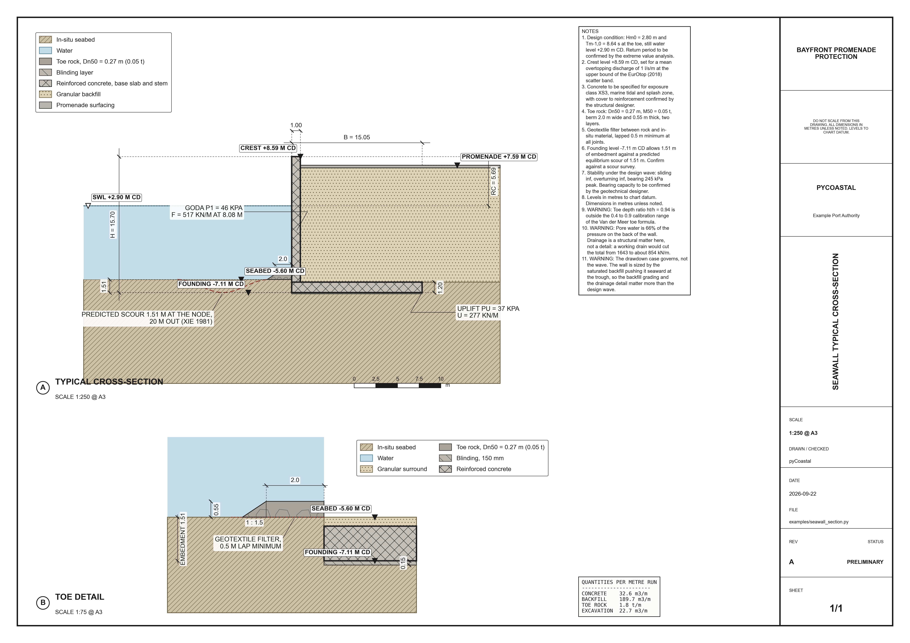
</p>

```python
from pyCoastal.applications.sections import seawall_sheet

sheet = seawall_sheet(design, project="Bayfront promenade protection",
                      client="Example Port Authority", size="A3")
sheet.save("seawall.png")     # 1:200 @ A3, stated on the sheet
sheet.to_dxf("seawall.dxf")   # geometry on named layers, for CAD
```

The sheet carries a typical section and an enlarged toe detail, because the
toe is the part that decides the section and the part a typical section is
always too small to explain.

Sections are drawn at a true scale by default, so a 1:2 slope looks like a
1:2 slope. Where a true scale is unreadable, as it is for a channel six
hundred metres wide and twenty deep, the exaggeration is applied
deliberately and printed on the drawing next to the scale.

---

##  Simulation Preview

circular wave propagation from a central disturbance:

<p align="center">
  
</p>

---

## Applications

Scenario-level simulators built on the numerics, physics and tools layers.
Each takes an engineering design and reports the quantities a project
actually turns on.

### Design conditions from a record

Peaks over threshold and annual maxima, fitted by L-moments, with
declustering, the standard threshold diagnostics, and a bootstrap band.

```python
from pyCoastal.applications.extremes import fit_pot, mean_residual_life

mrl = mean_residual_life(record, thresholds)      # pick the threshold properly
fit = fit_pot(record, threshold=2.5, separation=24, samples_per_year=2920)

fit.return_value(100)                  # 100-year Hm0
fit.confidence(100, level=0.90)        # and how much it could have been
fit.extrapolation_note(100)            # how far past the record that reaches
print(fit.summary())
```

<p align="center">
  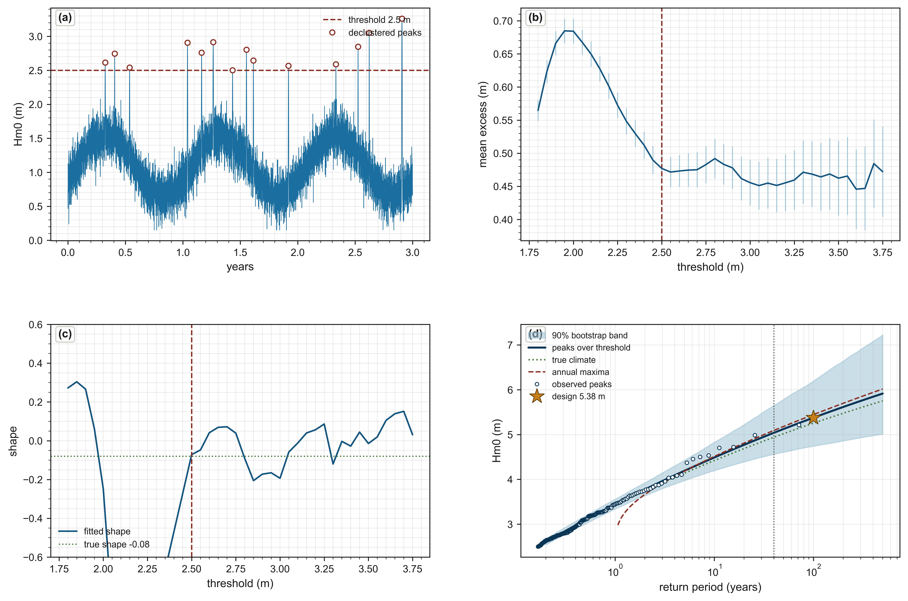
</p>

The worked example does what a real study cannot: because the record is
synthetic, it repeats the whole 40-year analysis on fresh records and
measures the true sampling spread of the 100-year estimate, then checks the
bootstrap band against it.

Worked example: `examples/design_wave.py`

### Beach nourishment

```python
from pyCoastal.applications.nourishment import (
    NourishmentDesign, WaveClimate, SECONDS_PER_YEAR,
    simulate_nourishment, renourishment_schedule,
)

design = NourishmentDesign(length=3000, berm_width=30, taper=200, D=8, B=2)
climate = WaveClimate(Hb=1.0, T=8.0, alpha0=0.0)

result = simulate_nourishment(design, climate, duration=20 * SECONDS_PER_YEAR)
result.design_life() / SECONDS_PER_YEAR   # years until 50% of the fill is gone
result.retained_fraction                  # volume retained vs time
result.berm_width                         # shoreline width at the fill centre

plan = renourishment_schedule(design, climate, horizon=30 * SECONDS_PER_YEAR)
plan["interval"], plan["n_renourishments"], plan["total_volume"]
```

The fill is evolved with the one-line model in `pyCoastal.tools.shoreline`.
`pelnard_considere` gives the linearized analytical solution for a rectangular
fill, which the test suite uses to verify the solver.

<p align="center">
  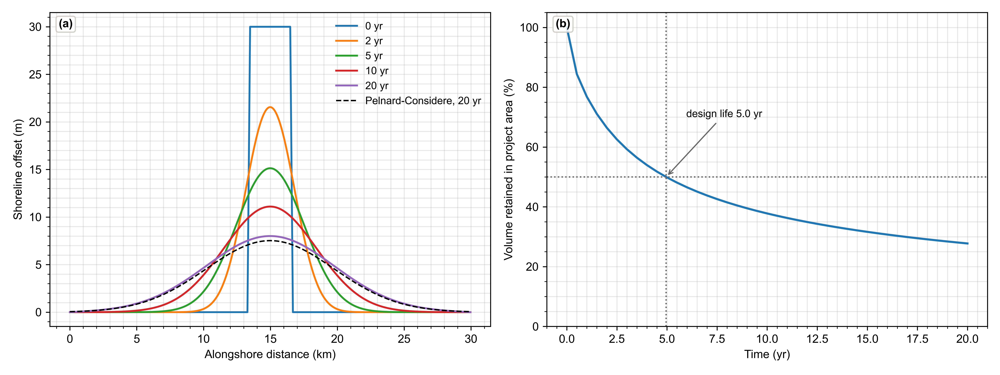
</p>

That analytical solution also draws. `nourishment_plan_section` maps the
planform spreading alongshore, at times taken from the fill's own half-life
so the view always covers the part of the evolution worth looking at:

```python
from pyCoastal.applications.sections import (
    nourishment_plan_section, spreading_half_life,
)

spreading_half_life(design, climate) / SECONDS_PER_YEAR   # years to lose half
nourishment_plan_section(design, climate).save("plan.png")
```

<p align="center">
  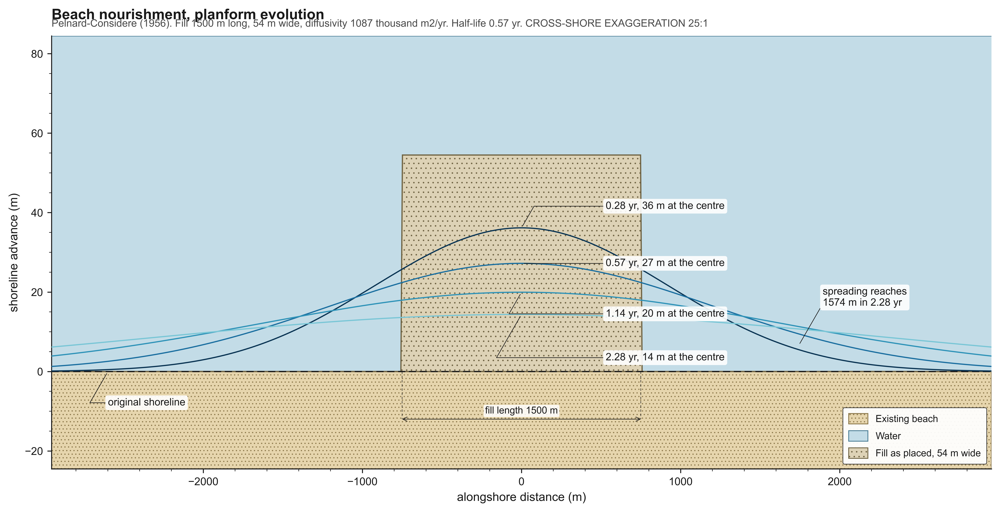
</p>

Both axes are distance, so the plan could be drawn 1:1 and should not be: a
fill is kilometres long and tens of metres wide. The cross-shore axis is
stretched to fill the sheet and the factor is stated on the drawing, the same
way a section states its vertical exaggeration. Pass `plan_design` and
`plan_climate` to `nourishment_sheet` to put the section and the plan on one
sheet, each at its own standard scale.

Worked examples: `examples/nourishment_design.py`,
`examples/nourishment_profile.py`

### Groynes and detached breakwaters

A nourishment adds sand. These add a constraint, and the shoreline
rearranges itself around it.

A groyne blocks the alongshore drift, and the linearized one-line equation
has an exact solution for that, so the fillet, the impounded volume and the
time to bypassing are all analytical:

```python
import math
from pyCoastal.applications.groynes import (
    LittoralCell, Groyne, design_groyne_field, fillet_geometry,
)
from pyCoastal.applications.nourishment import WaveClimate, SECONDS_PER_YEAR

cell = LittoralCell(D=6.0, B=2.0, bed="medium_sand")
climate = WaveClimate(Hb=1.0, T=7.0, alpha0=math.radians(4.0))

field = design_groyne_field(cell, climate, length=60, spacing=150, count=5)
field.spacing_ratio          # 2.5 groyne lengths
field.outflanked             # does the bay rotate back past the root?
field.downdrift_deficit      # sand taken off the coast downdrift
field.planform(x, t)         # shoreline along the whole field
```

<p align="center">
  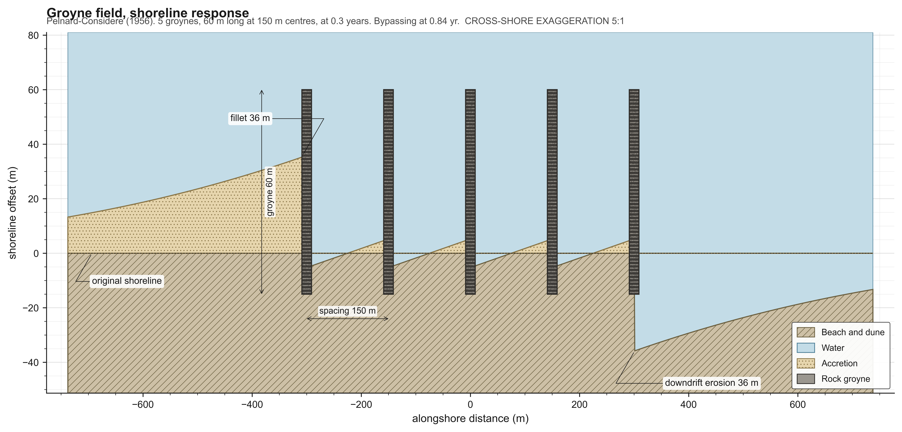
</p>

The drawing shows the erosion limb at the same weight as the fillet on
purpose: it is the same size, it arrives at the same rate, and a scheme
drawing that crops it is the reason groyne fields have the reputation they
do. `prefill=True` is the difference between a scheme that takes its sand
from the neighbours and one that pays for it.

The field is modelled in three parts, not by superposing single groynes. A
groyne is a zero-flux *boundary condition*, so a sum of single-barrier
solutions satisfies zero flux at none of them and grows without bound along
the field. Instead: the lone-groyne fillet updrift, a sealed **closed cell**
in each bay that tilts at constant volume towards a sawtooth of slope
`tan(alpha_b)`, and the mirrored erosion downdrift.

Detached breakwaters have no comparable closed form. What there is, is
classification rules on `Ls/X` that disagree with each other, so all three
are reported side by side:

```python
from pyCoastal.applications.groynes import (
    DetachedBreakwater, design_detached_scheme,
)

bw = DetachedBreakwater(length=120, offshore=90, gap=60, crest_level=1.5)
scheme = design_detached_scheme(cell, climate, bw, frontage=900,
                                Hs=2.0, period=8.0, Dn50=1.1)

scheme.verdict                   # consensus, or "disputed"
scheme.response["verdicts"]      # what each published rule says
scheme.transmission["Kt"]        # d'Angremond et al. (1996)
```

<p align="center">
  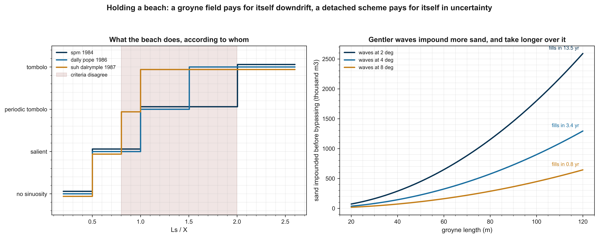
</p>

The criteria part company over `Ls/X` from 0.8 to 2.0, which is the band
most schemes are actually designed in. A split verdict is reported as
`"disputed"` rather than averaged into a number that would look more
certain than it is. Transmission matters for the same reason: those rules
were fitted to emergent structures that block nearly everything, so a
submerged sill passing half the wave height will not build what they
promise, and `design_detached_scheme` says so in its notes.

`parabolic_bay` gives the Hsu and Evans (1989) static equilibrium planform
for when you want a real shoreline rather than the schematic bulge on the
layout drawing.

Worked example: `examples/groyne_field.py`

### Port layout

Phase-resolved wave propagation into a harbour. Breakwaters are rasterized as
structures with a settable absorption, waves enter from a soft source, and the
open boundaries are sponge layers.

```python
import numpy as np
from pyCoastal.applications.port import IncidentWave, harbour_layout, simulate_port

layout = harbour_layout(gap=130, arm_length=300, back_wall=True, absorption=0.35)
wave = IncidentWave(height=1.5, period=9.0, direction=np.deg2rad(0))

result = simulate_port(layout, wave, sponge_sides=("west", "north", "south"))

result.disturbance_coefficient          # Kd = H / H_incident over the whole basin
result.probe((1120, 450))               # Kd at one point
result.berth_report({"quay": (1120, 450)})
result.operable_fraction({"quay": (1120, 450)}, limit=0.5)
```

The celerity comes from the linear dispersion relation at the run period, so
the wavelength is correct in intermediate water rather than the shallow-water
approximation. Against a semi-infinite breakwater the solver gives a deep quiet
shadow, Kd near 0.5 on the geometric shadow boundary, and Fresnel fringes in
the illuminated field.

<p align="center">
  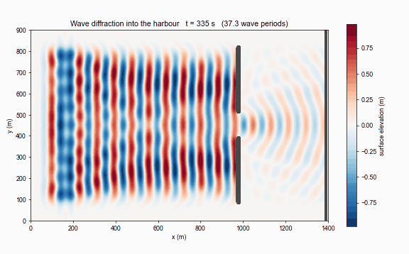
</p>

<p align="center">
  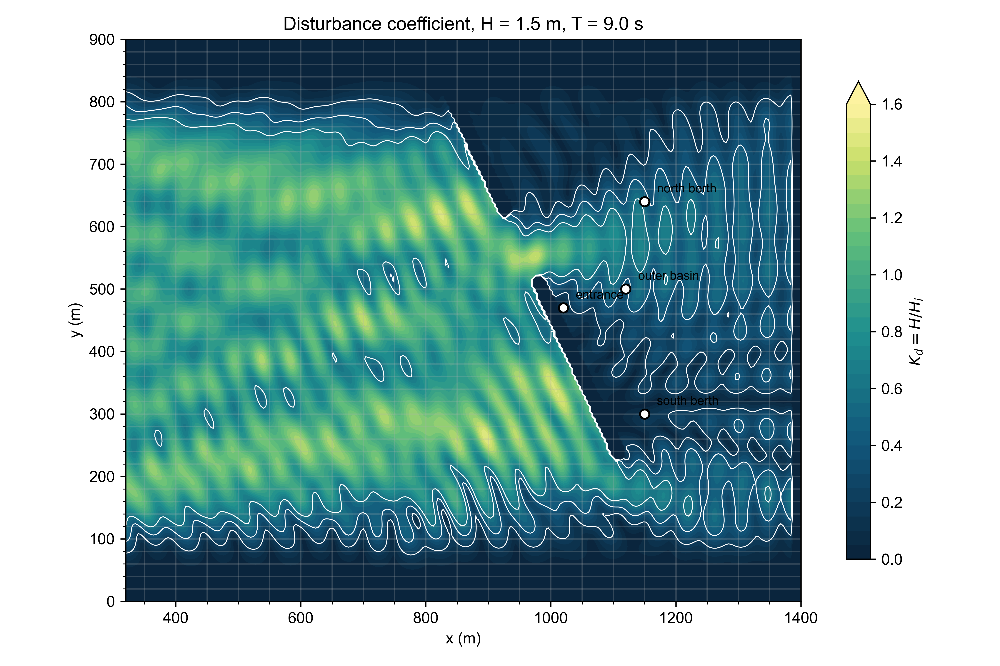
</p>

Five built-in layouts (`LAYOUTS`): two straight arms, overlapping arms with a
dog-leg entrance, a hooked main breakwater, a detached screen off the gap, and
an outer harbour protecting an inner marina basin.

<p align="center">
  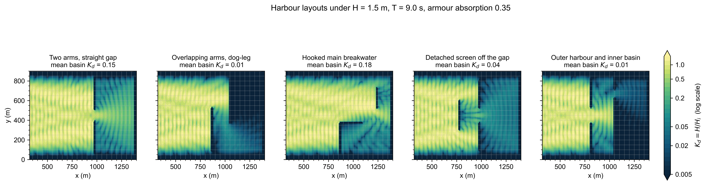
</p>

Wave direction is modelled by turning the harbour into the waves with
`rotate_layout` and driving it shore-normal. `IncidentWave.direction` also
works, but a phased source line only lights a parallelogram of the domain, so
`simulate_port` warns when a structure falls outside it.

Give structures an `absorption`: left fully reflecting, a detached screen forms
a pocket with the arms that rings, and basin agitation goes **up**. Armoured, the
same screen cuts mean basin Kd from 0.20 to 0.04.

Worked examples: `examples/port_diffraction.py`, `examples/port_layout_comparison.py`

### Rubble-mound breakwater design

Armour sizing and wave overtopping, with every relation traced to its source:
Van der Meer (1988) and Hudson (SPM 1984) for stability, EurOtop (2018) for
overtopping and tolerable discharge limits.

```python
from pyCoastal.applications.structures import DesignConditions, design_rubble_mound

conditions = DesignConditions.from_peak_period(
    Hm0=4.0, Tp=11.0, depth=12.0, storm_duration=6 * 3600,
)
design = design_rubble_mound(conditions, cot_alpha=2.0, tolerable_use="trained_staff")
print(design.summary())
```

```
Design condition   Hm0 = 4.00 m, Tm-1,0 = 10.00 s, depth = 12.0 m
Storm              6.0 h, N = 2160 waves
Slope              1 : 2
Armour             rock_two_layer_permeable, Dn50 = 1.59 m, M50 = 10.7 t (plunging)
Layer              3.18 m thick, 0.50 stones/m2
Crest freeboard    Rc = 5.69 m (Rc/Hm0 = 1.42)
Overtopping        mean 0.333 l/s/m, upper bound 1 l/s/m
Governing limit    1 l/s/m, Trained staff, well shod and protected, wide walkway
```

The crest is set so the **upper** bound of EurOtop's factor-of-three scatter
meets the limit, not the mean, which would be exceeded about half the time.

<p align="center">
  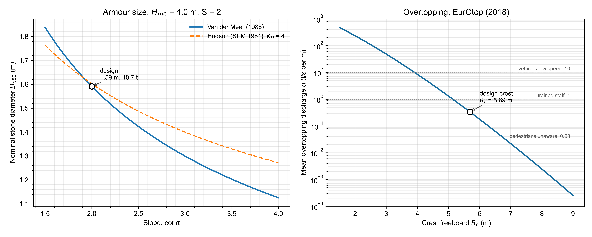
</p>

The same design issued as a drawing, with the armour drawn as individual
stones at the computed Dn50 and the layer quantities taken off the section:

<p align="center">
  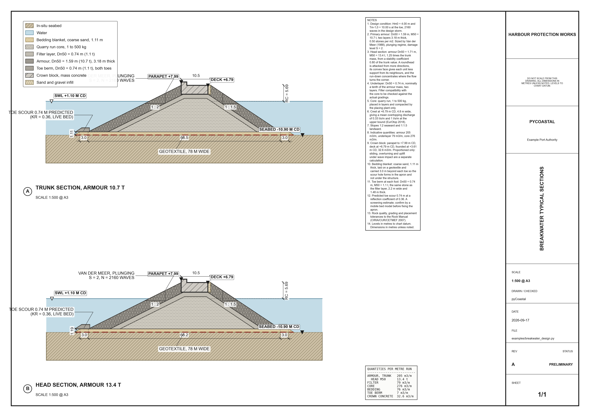
</p>

Worked example: `examples/breakwater_design.py`

### Vertical seawall design

The full chain for a gravity seawall: crest level from EurOtop, founding
level from scour, Goda wave pressures on the wetted face, then the base
width grown until sliding, overturning and the base pressure all pass.

```python
from pyCoastal.applications.seawall import design_seawall
from pyCoastal.applications.structures import DesignConditions

conditions = DesignConditions.from_peak_period(Hm0=2.8, Tp=9.5, depth=8.5)
wall = design_seawall(conditions, still_water_level=2.9, seabed_level=-5.6,
                      tolerable_use="trained_staff")
print(wall.summary())
wall.quantities()      # concrete, backfill, toe rock, excavation per metre run
```

```
Crest level         +8.59 m CD (Rc = 5.69 m, Rc/Hm0 = 2.03)
Founding level      -7.11 m CD (embedment 1.51 m, scour 1.51 m)
Base                12.15 m wide x 1.20 m thick, stem 1.00 m
Wave force          517 kN/m at 8.08 m above the base
Sliding FoS         2.37
Overturning FoS     2.99
Bearing             p_max = 336 kPa, e = +2.02 m
```

The middle-third check on the base pressure is usually what governs, not
sliding. Buoyancy is taken on the submerged part of the section, Goda uplift
is applied under the base, and the embedment adds lever arm but no wave
load, because below the seabed the wall is against soil.

Worked example: `examples/seawall_section.py`

### Navigation channel

How deep and how wide, built as a stack of allowances that can be argued
over line by line, which is how a dredging budget actually gets agreed.

```python
from pyCoastal.applications.channel import Vessel, design_channel

vessel = Vessel(name="Post-Panamax container ship", length=336, beam=48.2,
                draught=14.5, block_coefficient=0.68)

channel = design_channel(vessel, speed=8.0, design_water_level=1.20,
                         Hs=1.8, Tp=9.0, existing_bed=-11.5, two_way=True,
                         conditions={"crosswind": "moderate", "waves": "moderate"})

channel.dredge_level          # -16.37 m CD
channel.width                 # 415 m at the bed
channel.dredge_volume(1000)   # m3 per km of channel
```

<p align="center">
  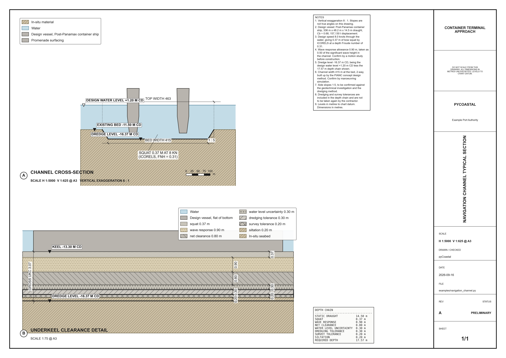
</p>

The sheet carries two views, as a real drawing set does: the whole channel
exaggerated so it is readable, and the underkeel clearance at a true scale
where the allowances can be read as real thicknesses.

The squat depends on the depth and the depth depends on the squat, so the
depth is solved rather than guessed. Width components you do not specify are
taken at their most benign class and **reported as assumed**, because a
silent default is how a channel ends up too narrow on paper.

<p align="center">
  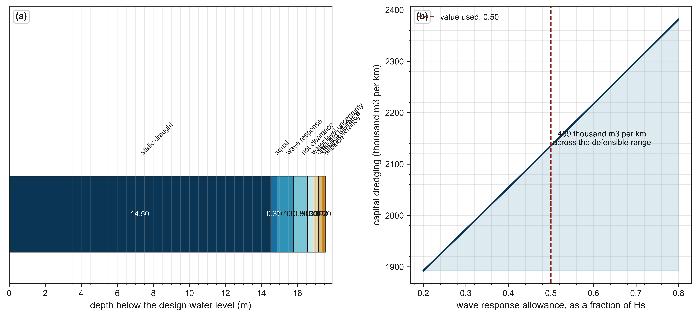
</p>

One judgement call, the fraction of the wave height taken as vertical vessel
motion, moves the dredge level more than every tolerance put together.

Worked example: `examples/navigation_channel.py`

### Wave loads on piles

Morison drag and inertia up the pile, integrated for base shear and mudline
moment, and swept through the wave cycle.

```python
from pyCoastal.applications.piles import design_monopile

result = design_monopile(diameter=8.0, H=12.0, T=13.0, depth=30.0)
result["load"].force / 1e3        # kN, at the worst phase
result["load"].moment / 1e6       # MNm about the mudline
result["load"].inertia_fraction   # 0.90: this pile is inertia dominated
result["crest_underestimate"]     # 0.62
```

<p align="center">
  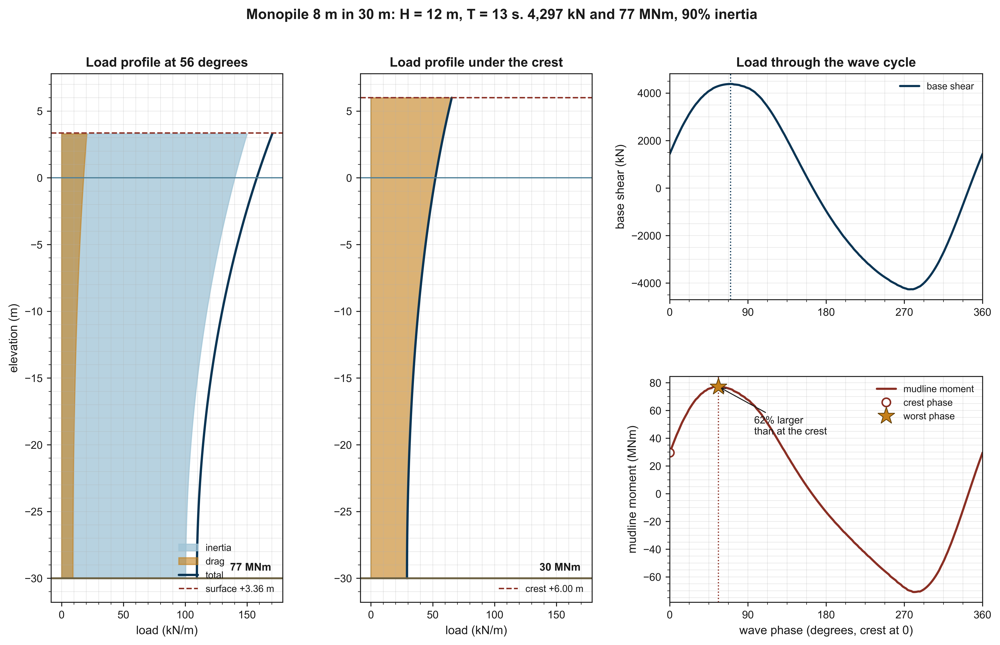
</p>

A large monopile is inertia dominated, so the load follows the fluid
acceleration, which peaks a quarter cycle **before** the crest. Evaluating
the load under the crest, because that is where the water is highest,
understates the overturning moment by 62 per cent in this case. That is what
the phase sweep exists to catch.

| D (m) | KC | regime | inertia share | mudline moment |
|-------|----|--------|---------------|----------------|
| 1 | 51 | drag dominated | 5% | 3.8 MNm |
| 2 | 25 | drag dominated | 15% | 8.1 MNm |
| 4 | 13 | mixed | 50% | 20.7 MNm |
| 8 | 6.3 | mixed | 90% | 77.2 MNm |
| 12 | 4.2 | mixed | 96% | 176.0 MNm |

Wheeler stretching carries the linear kinematics up to the instantaneous
surface. Scour follows Sumer, Fredsoe and Christiansen (1992), which
correctly predicts that waves alone barely scour a pile this large, because
KC is small; current is what governs.

Worked example: `examples/pile_wave_loads.py`

### Storm surge and flooding

A water-level budget assembled from its components, then flood mapping that
respects hydraulic connectivity.

```python
import numpy as np
from pyCoastal.applications.surge import (
    StormConditions, total_water_level, bathtub_flood, isolated_low_ground,
)

storm = StormConditions(wind_speed=45, central_pressure=94000, tide=0.6,
                        Hm0=7.0, Tp=13.0, fetch=120e3)

# Integrate wind setup across a real shelf rather than a representative depth
shelf = np.linspace(60.0, 8.0, 200)
levels = total_water_level(storm, shelf_depths=shelf, dx=120e3 / 199)
levels["still_water_level"]     # drives inundation extent
levels["total_water_level"]     # adds R2% runup, for the shoreline wave hazard

sea = np.zeros_like(terrain, dtype=bool); sea[0, :] = True
flooded = bathtub_flood(terrain, levels["still_water_level"], seed=sea)
stranded = isolated_low_ground(terrain, levels["still_water_level"], seed=sea)
```

Connectivity matters: a plain elevation threshold floods every low cell,
including basins the sea cannot reach. In the worked example a single breach
in the barrier is the difference between **5.4 km2** and **18.8 km2** flooded.

<p align="center">
  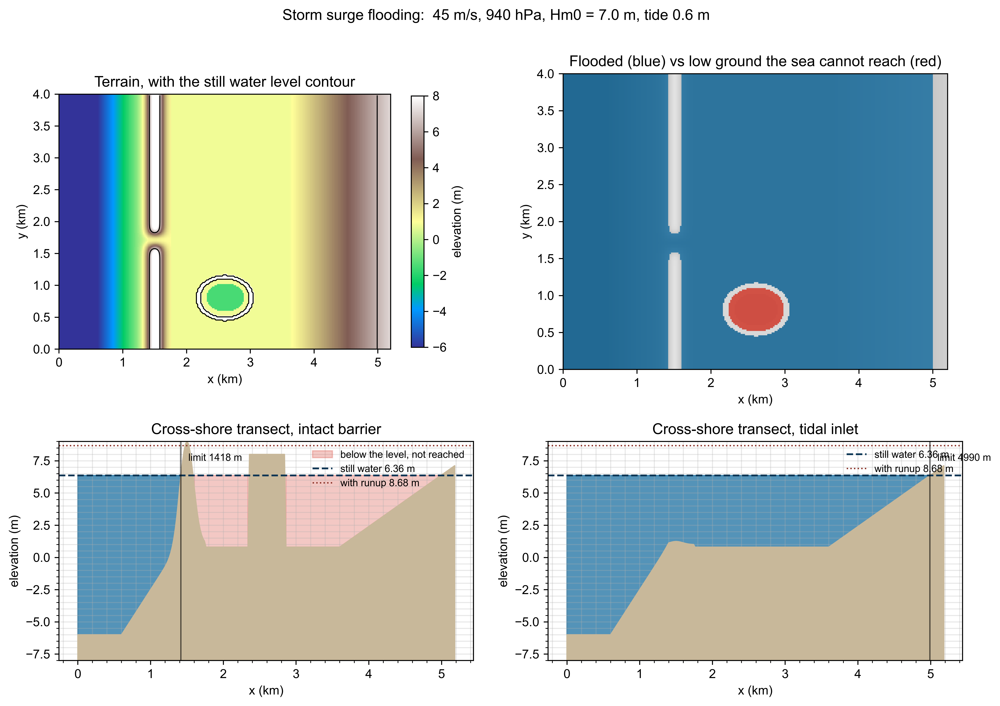
</p>

Worked example: `examples/storm_surge_flooding.py`


### 📚 Citation

If you use **pyCoastal** in a scientific publication, please cite:

> **Biondi, S.** (2025)  
> _pyCoastal: a Python package for Coastal Engineering_  
> GitHub: [https://github.com/stebiondi/pyCoastal](https://github.com/stebiondi/pyCoastal)  
> Version: v0.2.0  

You can also use this BibTeX entry:

```bibtex
@software{pyCoastal2025,
  author  = {Biondi, Stefano},
  title   = {{pyCoastal}: Modular Coastal Process Modeling in Python},
  year    = {2025},
  url     = {https://github.com/stebiondi/pyCoastal},
  version = {v0.2.0}
}
